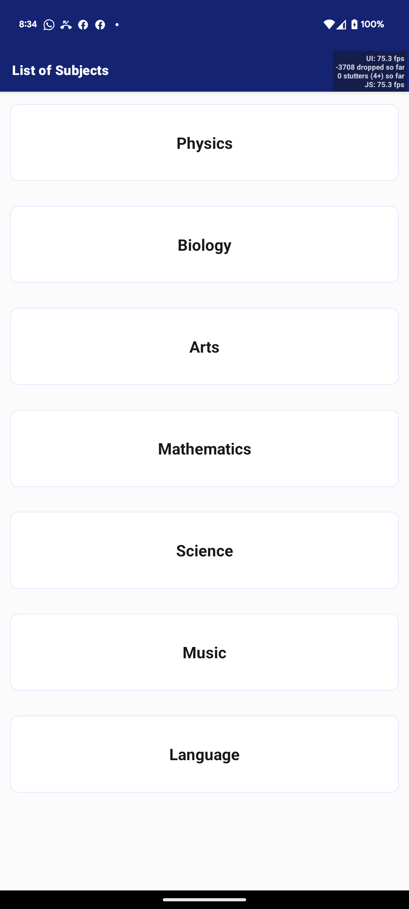
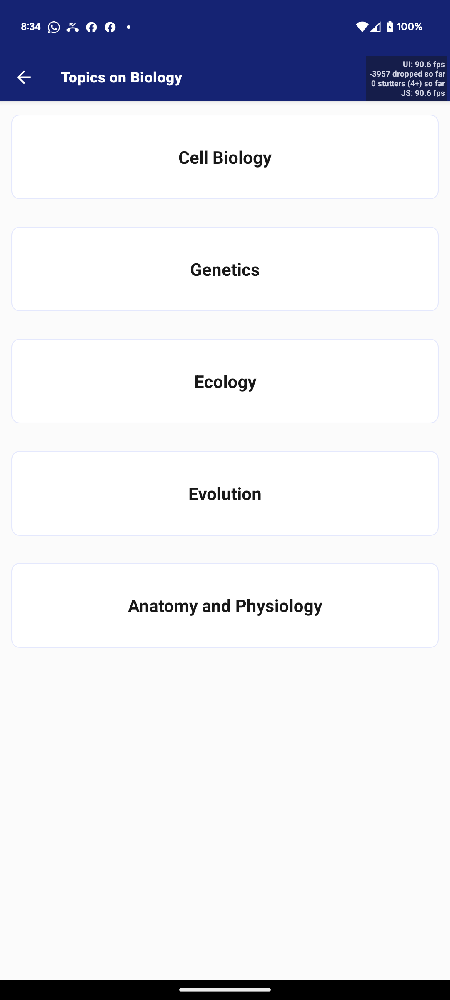
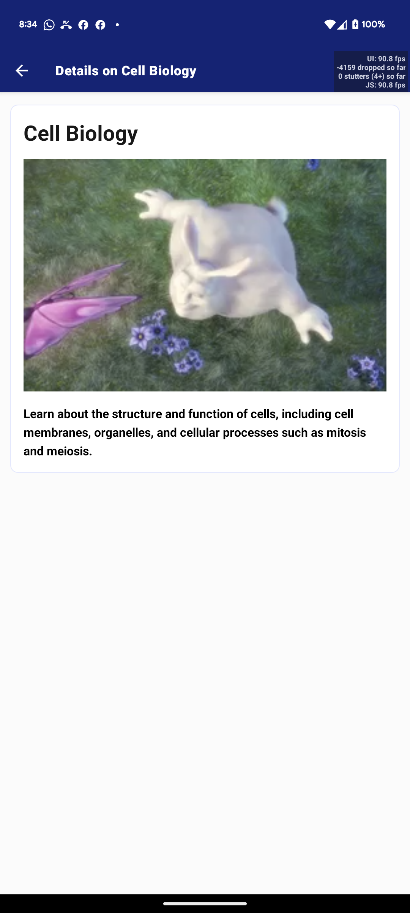

# Learning App

The Learning App is a simple react native application designed to help users learn various subjects and topics. It provides a user-friendly interface for viewing subjects, topics, and topic information.

## Features

- List of Subjects: Users can view a list of subjects available in the app.
- List of Topics: When a subject is clicked, users can view a list of topics related to that subject.
- Topic Information: When a topic is clicked, users can view detailed information about the topic, including title, video, and description.
Responsive Design: The app is designed to be responsive and usable on various screen sizes and devices.

## Tech Stack

- ExpressJS: A fast and minimal web application framework for Node.js.
- MongoDB: A popular NoSQL database for storing and retrieving data.
- Mongoose: A MongoDB object modeling tool for Node.js that provides a higher-level abstraction for working with MongoDB.
- Expo: A React-Native development framework for building UI components and handling user interactions.

## Server Installation

Clone the repository.
Install dependencies using below.

```bash
cd server && npm install
```

Set up a MongoDB database and connection.
Update the configuration file with your database connection details.
Start the app using npm start.

## Database Sample Data

The data used during development is located in the ```server``` folder and named ```subjects.json```.

To import into mongodb using ```mongoimport```, run

```bash
mongoimport --db learning-app --collection subjects --jsonArray --file subjects.json
```

## Expo Installation

Install dependencies using below.

```bash
cd app && npx expo install && npm install
```

Run app using ```npx expo start```

### API Endpoints

The app provides the following API endpoints for performing read operations on subjects and topics:

- **GET /subjects:** Retrieve a list of all subjects.
- **GET /subject/:id:** Retrieve detailed information about a specific subject by ID.

### UI Components

The app includes the following UI components for interacting with subjects and topics:

- **Subject List:** Displays a list of subjects with their titles.
- **Topic List:** Displays a list of topics related to a selected subject with their titles.
- **Topic Information:** Displays detailed information about a selected topic, including title, video, and description.

## Screenshots

Screenshots of developed app are below.





## License

The Learning App is open-source software released under the MIT License.
